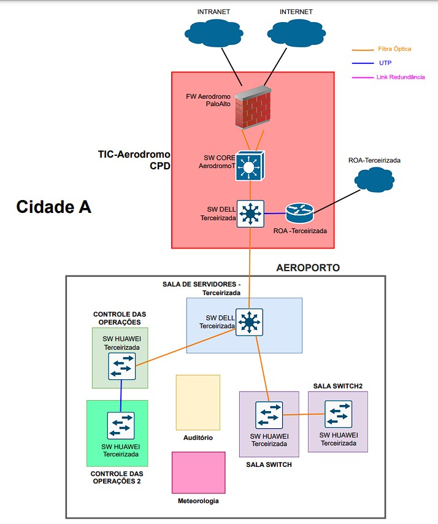
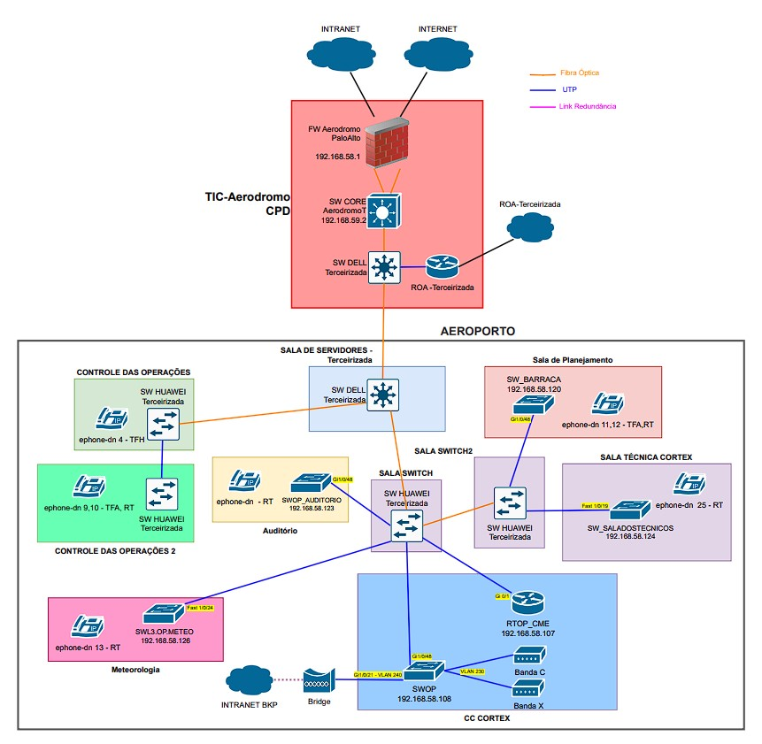

# Projeto de Infraestrutura de Redes e Telefonia - Cisco em grande evento de Aviação

## Descrição Geral

Este repositório documenta a implementação de uma infraestrutura de redes e telefonia utilizando equipamentos Cisco em um grande evento de aviação. O projeto visou integrar a comunicação de VoIP e hotlines entre diferentes locais do evento, realizados simultaneamente em cidades distintas. Além disso, foram implementadas soluções para videoconferência ponto a ponto e redundância de links, garantindo alta disponibilidade dos serviços.

Apresentamos aqui a topologia física e lógica projetada, as configurações dos ativos de rede, os desafios enfrentados durante a implementação e as soluções aplicadas. Este material serve como uma referência prática para profissionais de redes e entusiastas interessados em projetos similares.

## Cenário e Contextualização

O evento foi realizado em um aeródromo com infraestrutura composta por:

*Equipamentos existentes:* Firewall Palo Alto, switches Dell e Huawei.
*Rede operacional:* Redes intranet e internet do aeródromo.

A organização exigiu:

- Comunicação eficiente via VoIP entre as salas do evento e outro local simultâneo em outra cidade.
- 3 Videoconferências ponto a ponto com outra cidade em alta disponibilidade.
- Garantia de alta disponibilidade de dados e voz por meio de links redundantes.

Por questões de sigilo, a topologia inicial foi ajustada para incluir apenas os elementos diretamente relacionados ao escopo deste projeto.



## Serviços Prestados

Os principais serviços realizados durante o projeto incluem:

1. **Planejamento e Design da Rede:**
   - Criação da topologia física e lógica.
   - Seleção de equipamentos e dimensionamento dos recursos necessários.

2. **Implementação da Infraestrutura de Rede:**
   - Configuração de switches e roteadores Cisco.
   - Segmentação de tráfego com VLANs.

3. **Assessoria à equipe de Segurança da Informação:**
   - Definição e aplicação de regras de firewall para os serviços implementados.

4. **Sistema de Telefonia:**
   - Configuração de VoIP utilizando Call Manager.
   - Integração entre as redes locais e remotas.

5. **Redundância de Links:**
   - Configuração de uma bridge para links redundantes.
   - Automação do plano de continuidade com script específico.

6. **Testes e Otimizações:**
   - Verificação de conectividade, qualidade de chamadas e estabilidade de links.
   - Ajustes conforme novas demandas surgiram durante o evento.

## Topologia Física e Lógica

As topologias desenvolvidas estão detalhadas abaixo:

### Topologia Física



Esta topologia abrange exclusivamente os componentes e redes que fazem parte do escopo do projeto.

### Topologia Lógica

[Adicione aqui o diagrama lógico, caso tenha.]

> **Nota:** Os diagramas estão disponíveis na pasta `diagrams` deste repositório.

## Configurações dos Ativos

    As configurações mais relevantes dos equipamentos utilizados são apresentadas a seguir:

### Roteador CME

#### Configuração básica
```plaintext
!
hostname RTOP_CME
!
no ip domain lookup
ip domain name tic.intranet
!
interface Loopback0
 ip address 192.168.165.5 255.255.255.255
!
interface GigabitEthernet0/0
 description WAN
 ip address 192.168.165.2 255.255.255.252
 duplex auto
 speed auto
!
interface GigabitEthernet0/1
 description LAN AERODROMO INTRANET
 ip address 192.168.58.107 255.255.255.128
 duplex auto
 speed auto
!
no ip http server
no ip http secure-server
!         
```

#### Configuração de Roteamento
```plaintext
ip route 192.168.0.0 255.255.0.0 192.168.58.1
!
ip default-gateway 192.168.58.1
ip forward-protocol nd
!
```

#### Configuração de Telefonia Voip
```plaintext
!
voice service voip
 no ip address trusted authenticate
 callmonitor
 dtmf-interworking rtp-nte
 allow-connections h323 to h323
 allow-connections h323 to sip
 allow-connections sip to h323
 allow-connections sip to sip
 supplementary-service h450.12
 fax protocol t38 version 0 ls-redundancy 0 hs-redundancy 0 fallback none
 h323
 sip
!
voice class codec 1
 codec preference 1 g729r8
 codec preference 2 g729br8
 codec preference 3 g711ulaw
 codec preference 4 g711alaw
!
voice class h323 1
  h225 timeout tcp establish 5
!
dial-peer voice 20 voip
 description VOICE PABX RECIFE 3
 destination-pattern 3003[012]..
 session target ipv4:192.168.252.3
 dtmf-relay rtp-nte h245-alphanumeric
 codec g729r8 bytes 50
 ip qos dscp cs5 media
!
telephony-service
 sdspfarm units 10
 sdspfarm transcode sessions 8
 sdspfarm tag 1 CME
 conference hardware
 conference transfer-pattern
 no auto-reg-ephone
 max-ephones 165
 max-dn 200
 ip source-address 192.168.58.107 port 2000 secondary 192.168.165.5
 ip qos dscp cs5 media
 calling-number local
 service phone paramEdibility 1
 service dss
 timeouts interdigit 2
 cnf-file location flash:
 cnf-file perphone
 load 7906 SCCP11.9-4-2SR1-1S.loads
 load 7931 SCCP31.9-4-2SR2-2S
 load 7941 SCCP41.9-4-2SR1-1S.loads
 olsontimezone America/Sao_Paulo version 2016z
 time-zone 14
 time-format 24
 date-format dd-mm-yy
 max-conferences 8 gain -6
 call-forward pattern .T
 transfer-system full-consult
 transfer-pattern .T
 create cnf-files version-stamp Jan 01 2002 00:00:00
!
ephone-template  1
 max-calls-per-button 2
 button-layout 7931 2
 codec g729r8
 type 7931
!
ephone-template  2
 softkeys hold  Resume Newcall
 softkeys idle  Redial Dnd Newcall
 softkeys seized  Endcall Redial
 softkeys alerting  Endcall
 softkeys connected  Endcall Hold Trnsfer
 softkeys ringing  Answer Dnd
!
ephone-dn  1
 number 2081001
 label RTF1 COP
 description DIRECTOR
 name DIRECTOR
 intercom 3003213 no-auto-answer
!
ephone-dn  2
 number 2081002
 label RTF3 3913-8362
 description DIRECTOR
 name DIRECTOR
 intercom 3003236 no-auto-answer
!
ephone-dn  3
 number 2081003
 label RTF3 3913-8364
 description SALA DE PLANEJAMENTO
 name SALA DE PLANEJAMENTO
 intercom 3003238 no-auto-answer
!
ephone-dn  4
 number 2081004
 label RTF1 COP
 description CONTROL
 name CONTROL
 intercom 3003214 no-auto-answer
!
ephone-dn  5
 number 2081005
 label RTF3 3913-8363
 description SALA DE CRISE
 name SALA DE CRISE
 intercom 3003237 no-auto-answer
!
ephone-dn  6
 number 2081006 secondary 8106
 label RT 9806
 description SALA DE CRISE
 name SALA DE CRISE
!
ephone-dn  7
 number 2081007 secondary 8107
 label RT 9807
 description AUDITORIO
 name MASS AUDITORIO
!
ephone-dn  8
 number 2081008
 label RTF1 COP
 description SALA DE CRISE
 name SALA DE CRISE
 intercom 3003215 no-auto-answer
!
ephone-dn  9
 number 2081009
 label RTF3 3913-8365
 description SALA DE PLANEJAMENTO
 name SALA DE PLANEJAMENTO
 intercom 3003239 no-auto-answer
!
ephone-dn  10
 number 2081010 secondary 9810
 label RT 9810
 description SALA DE PLANEJAMENTO
 name SALA DE PLANEJAMENTO
!
ephone-dn  11
 number 2081011
 label RTF3 3913-8366
 description CONTROLE DAS OPERACOES
 name CONTROLE DAS OPERACOES
 intercom 3003235 no-auto-answer
!
ephone-dn  12
 number 2081012
 label RT 9812
 description CONTROLE DAS OPERACOES
 name CONTROLE DAS OPERACOES
!         
ephone-dn  13
 number 2081013 secondary 9813
 label RT 9813
 description METEOROLOGIA
 name METEOROLOGIA
!
ephone  1 
 device-security-mode none
 description DIRECTOR
 mac-address 64AE.0CF7.BBBB
 ephone-template 1
 max-calls-per-button 2
 codec g729r8
 type 7931
 auto-line 1 answer-incoming
 button  1:1 2:2
!
ephone  2
 device-security-mode none
 description SALA DE PLANEJAMENTO
 mac-address 0024.C4BE.CCCC
 ephone-template 1
 max-calls-per-button 2
 codec g729r8
 type 7931
 auto-line 1 answer-incoming
 button  1:3
!
ephone  3
 device-security-mode none
 description SALA DE CRISE
 mac-address 64AE.0CF7.DDDD
 ephone-template 1
 max-calls-per-button 2
 codec g729r8
 type 7931
 auto-line 1 answer-incoming
 button  1:8 2:5 3:6
!
ephone  4
 device-security-mode none
 description AUDITORIO
 mac-address 7010.5C5E.EEEE
 ephone-template 1
 max-calls-per-button 2
 codec g729r8
 type 7931
 auto-line 1 answer-incoming
 button  1:7
!
ephone  5
 device-security-mode none
 description CONTROLE DAS OPERACOES
 mac-address ACA0.166E.FFFF
 ephone-template 1
 max-calls-per-button 2
 codec g729r8
 type 7931
 auto-line 1 answer-incoming
 button  1:4 2:9 3:10
!
ephone  6
 device-security-mode none
 description SALA DE PLANEJAMENTO
 mac-address F025.7278.AAAA
 ephone-template 1
 max-calls-per-button 2
 codec g729r8
 type 7931
 auto-line 1 answer-incoming
 button  1:11 2:12
!
ephone  7
 device-security-mode none
 mac-address 0C85.253E.ABBB
 ephone-template 1
 max-calls-per-button 2
 codec g729r8
 type 7931
 auto-line 1 answer-incoming
 button  1:13
!
ephone  8
 device-security-mode none
 description EPHONE 8
 mac-address 2C36.F859.CCCC
 ephone-template 1
 max-calls-per-button 2
 codec g729r8
 type 7931
 auto-line 1 answer-incoming
 button  1:20
!
ephone  9
 device-security-mode none
 description EPHONE 9
 mac-address 5897.1E29.DDDD
 max-calls-per-button 2
 type 7931
 auto-line 1 answer-incoming
 button  1:20
!         
ephone  10
 device-security-mode none
 description EPHONE 10
 mac-address 2C36.F859.EEEE
 ephone-template 1
 max-calls-per-button 2
 codec g729r8
 type 7931
 auto-line 1 answer-incoming
 button  1:20
!
ephone  11
 device-security-mode none
 description EPHONE 11
 mac-address 2C36.F859.FFFF
 ephone-template 1
 max-calls-per-button 2
 codec g729r8
 type 7931
 auto-line 1 answer-incoming
 button  1:20
!
ephone  12
 device-security-mode none
 description EPHONE 12
 mac-address 2C36.F859.AAAA
 ephone-template 1
 max-calls-per-button 2
 codec g729r8
 type 7931
 auto-line 1 answer-incoming
 button  1:20
!
ephone  13
 device-security-mode none
 description SALA TECNICA
 mac-address 64AE.0CF7.BBBB
 ephone-template 1
 max-calls-per-button 2
 codec g729r8
 type 7931
 auto-line 1 answer-incoming
 button  1:1 2:2 3:3 4:4
 button  5:5 6:6 7:7 8:8
 button  9:9 10:10 11:11 12:12
 button  13:13
!
```
#### Configuração de Túnel
```plaintext
!
interface Serial0/1/1
 description TUNNEL_B34 SM 
 no ip address
 clock rate 19200
 no cdp enable
 xconnect 192.168.160.5 8 encapsulation l2tpv3 manual pw-class 1CC1
  l2tp id 8 8
!
cem 2/0/0
 clock rate 19200
 clock source internal
 payload-size 64
 xconnect 192.168.130.5 0 encapsulation udp
  local ip addr 192.168.130.5
  local udp port 15902
  remote udp port 15901
!
pseudowire-class 1CC1
 encapsulation l2tpv3
 sequencing transmit
 protocol none
 ip local interface Loopback0
 ip tos value 160
 ip ttl 8
!
```
---

### Switches
```plaintext
# Configuração de VLANs


# Configuração de portas


# Configuração de STP


# Configuração de Etherchannel

```
---

### 7. Problemas Encontrados e Soluções
Será Listado os problemas encontrados durante o projeto e explique como foram resolvidos.

```markdown
## Problemas Encontrados e Soluções

1. **Problema: Configuração incorreta de Roteamento no roteador.**
   - **Causa:** Configuração errada
   - **Solução:** Revisão e correção 

2. **Problema: Loop na rede devido a má configuração de STP.**
   - **Solução:** Configuração e verificação do protocolo Spanning Tree.
